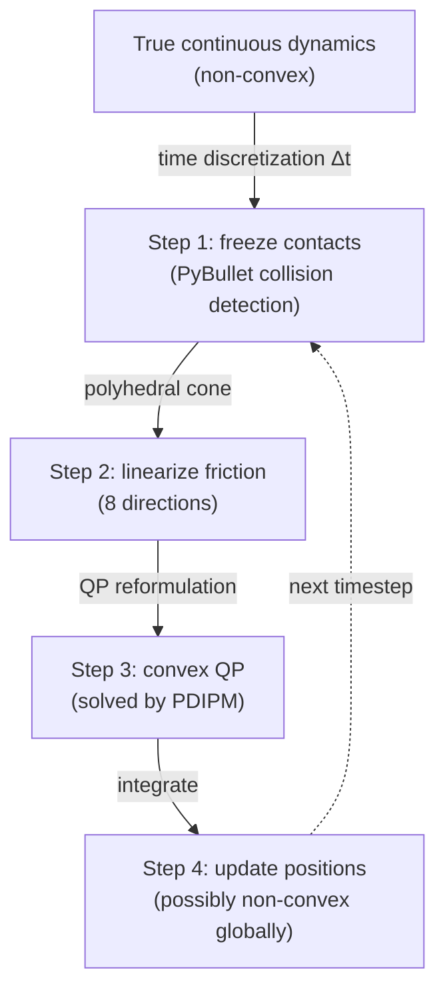

Excellent question. You're right that **full rigid body dynamics with Coulomb friction is non-convex** (nonlinear complementarity, non-associated flow rule, potential Painlevé paradox). The trick is **time-stepping linearization** — the problem is convexified at each discrete step.

## The time-stepping scheme

At each timestep (fixed `dtime`), PIN-WM freezes the nonlinearities:

```python
# lcp_solver.py — everything is linear in v (new velocity)
M = self.M()                                    # constant mass matrix per step
Jc = self.Jc(contact_infos)                     # contact Jacobian (fixed normals from PyBullet)
Jf = self.Jf(contact_infos)                     # 8-direction friction approximation
mu = self.mu(contact_infos)                     # linearized Coulomb cone
```

This is the **Anitescu-Potra / Stewart-Trinkle time-stepping formulation** — the standard approach used in Bullet, MuJoCo, Drake, and essentially all real-time physics engines.

## Polyhedral friction cone → convexity

True Coulomb friction is a **nonlinear cone** (the contact force must lie inside a circular cone defined by $\|\mathbf{f}_t\| \leq \mu f_n$). PIN-WM approximates this with **8 discretized directions**:

```python
# 8 friction directions forming a polyhedral approximation of the Coulomb cone
dir1 = normalize(orthogonal(normal))
dir2 = normalize(cross(dir1, normal))
dir3 = normalize(dir1 + dir2)    # 45° diagonals
dir4 = normalize(cross(dir3, normal))
dirs = [dir1, dir2, dir3, dir4, -dir1, -dir2, -dir3, -dir4]
```

This turns the nonlinear friction constraint $\|\mathbf{f}_t\| \leq \mu f_n$ into **linear inequalities**:

$$-\mu f_n \leq f_{t,i} \leq \mu f_n \quad \text{for each of the 8 directions}$$

which are linear in the decision variables (contact impulses $\lambda$).

## The resulting QP is convex

With velocities $\mathbf{v}$ and contact impulses $\boldsymbol{\lambda}$ as variables:

$$\min_{\mathbf{v}, \boldsymbol{\lambda}} \frac{1}{2} \mathbf{v}^T \mathbf{M} \mathbf{v} - (\mathbf{M}\mathbf{v}_0 + \Delta t \cdot \mathbf{f}_{\text{ext}})^T \mathbf{v}$$

$$\text{s.t.} \quad \mathbf{J}_c \mathbf{v} \geq -\varepsilon \mathbf{J}_c \mathbf{v}_0 \quad \text{(non-penetration)}$$
$$\quad \mathbf{J}_f \mathbf{v} + \mathbf{E}\boldsymbol{\lambda}_n \geq 0 \quad \text{(friction cone)}$$
$$\quad \boldsymbol{\lambda} \geq 0 \quad \text{(compressive only)}$$

| Property | Why convex |
|---|---|
| Objective Hessian $\mathbf{M}$ | Block-diagonal of mass matrices → **positive definite** ✓ |
| Inequality constraints | All **linear** in $(\mathbf{v}, \boldsymbol{\lambda})$ ✓ |
| Equality constraints | Joint constraints, also **linear** ✓ |
| Complementarity | Reformulated as QP via KKT → convex QP ✓ |

## Why this works despite the true non-convexity



The convexity is **per timestep, not global**. Each individual QP is convex because:
1. PyBullet detects contacts and provides **fixed normals** for this step
2. Friction is **linearized** into a polyhedral cone
3. The mass matrix is **constant** within the step

The global trajectory can still be non-convex (e.g., stick-slip transitions, contact mode changes), but each step's velocity solve is a well-behaved convex QP. This is the same approach that makes **MuJoCo and Bullet computationally tractable** for real-time robotics simulation.

Updated todo list