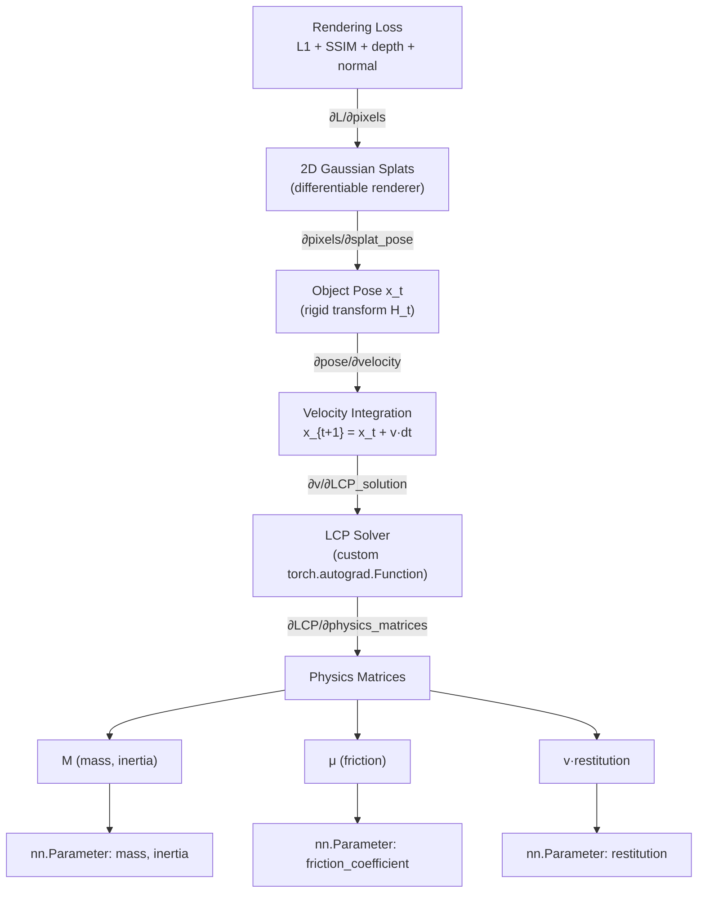

Read [](file:///home/xiao/0_codes/PIN-WM/diff_simulation/simulator.py#1-1), lines 1 to 100

Read [](file:///home/xiao/0_codes/PIN-WM/diff_simulation/solver/cvxpy.py)

Read [](file:///home/xiao/0_codes/PIN-WM/diff_simulation/solver/lcp_solver.py#1-1), lines 1 to 100

Read [](file:///home/xiao/0_codes/PIN-WM/diff_simulation/solver/lcp_solver.py#100-100), lines 100 to 200

Read [](file:///home/xiao/0_codes/PIN-WM/diff_simulation/physical_material.py)

Read [](file:///home/xiao/0_codes/PIN-WM/diff_simulation/solver/lcp_solver.py#200-200), lines 200 to 331

Read [](file:///home/xiao/0_codes/PIN-WM/diff_simulation/simulator.py#100-100), lines 100 to 200

Created 5 todos

Read [](file:///home/xiao/0_codes/PIN-WM/diff_simulation/simulator.py#200-200), lines 200 to 256

Here's the complete gradient flow, traced end-to-end:



**The key insight**: the gradient chain has **three distinct differentiability mechanisms**:

### 1. Native PyTorch autograd (the easy parts)

Everything about the 2DGS renderer and pose integration is standard PyTorch. The splat positions, rotations, colors, opacities — all `torch.Tensor` with `requires_grad`. The renderer's forward pass produces pixel colors via alpha blending; backward flows through automatically.

```python
# From scripts/run.py — gradient flows from rendering loss through the pose
gaussians.reset_position_rotation(obj_position, obj_rotation)  # differentiable rigid transform
render_pkg = gaussian_renderer.render(camera, gaussians)         # differentiable splat rasterization
loss = rendering_loss_batch(images, gt_images)                    # L1 + SSIM
loss.backward()  # ← autograd traces back through all of this
```

### 2. Custom `torch.autograd.Function` (the physics solver)

The LCP (Linear Complementarity Problem) solver is **not** native PyTorch — it's a `Function` with a **hand-written analytical backward pass**:

```python
class LCPFunctionFn(Function):
    @staticmethod
    def forward(ctx, Q, p, G, h, A, b, F):
        # Solves the QP using a primal-dual interior point method
        zhats = pdipm_b.forward(Q, p, G, h, A, b, F, ...)
        ctx.save_for_backward(zhats, Q, p, G, h, A, b, F)
        return zhats

    @staticmethod
    def backward(ctx, dl_dzhat):
        # Analytical gradients via KKT conditions
        # ∂L/∂Q, ∂L/∂p, ∂L/∂G, ∂L/∂h, ∂L/∂F
        dQs = 0.5 * (bger(dx, zhats) + bger(zhats, dx))
        dGs = bger(dlam, zhats) + bger(ctx.lams, dx)
        dhs = -dlam
        dFs = bger(dlam, ctx.lams)
        return (dQs, dps, dGs, dhs, dAs, dbs, dFs)
```

This code is **borrowed from [`locuslab/qpth`](https://github.com/locuslab/qpth)** (Stanford/MIT), a well-known differentiable QP solver library. The cvxpy.py file confirms this:

```python
# This file originates from
# https://github.com/locuslab/lcp-physics, licensed under Apache License, version 2.0
```

### 3. `nn.Parameter` wrapping (the physics knobs)

Physical properties are wrapped as `nn.Parameter` with logit-space constraints:

```python
class Physical_Materials:
    def __init__(self, requires_grad, device):
        self.all["friction_coefficient"] = nn.Parameter(
            torch.tensor(random.uniform(-5, 5)), requires_grad=True
        )
        self.all["mass"] = nn.Parameter(...)
        self.all["inertia"] = nn.Parameter(...)
        self.all["restitution"] = nn.Parameter(...)

    def get_material(self, name):
        if name == "friction_coefficient":
            return torch.sigmoid(self.all[name])  # maps (-∞,∞) → (0,1)
```

### Full gradient chain in one equation

$$\frac{\partial \mathcal{L}_{\text{render}}}{\partial \theta} = 
\underbrace{\frac{\partial \mathcal{L}}{\partial \hat{I}}}_{\text{L1+SSIM}} \cdot
\underbrace{\frac{\partial \hat{I}}{\partial \mathbf{H}_t}}_{\text{2DGS render}} \cdot
\underbrace{\frac{\partial \mathbf{H}_t}{\partial \mathbf{x}_t}}_{\text{rigid transform}} \cdot
\underbrace{\frac{\partial \mathbf{x}_t}{\partial \mathbf{v}}}_{\text{Euler integration}} \cdot
\underbrace{\frac{\partial \mathbf{v}}{\partial (\mathbf{M},\boldsymbol{\mu},\mathbf{v}_0)}}_{\text{LCP KKT backward}} \cdot
\underbrace{\frac{\partial (\mathbf{M},\boldsymbol{\mu},\mathbf{v}_0)}{\partial \theta}}_{\text{sigmoid/clip}}$$

**So yes — it's all PyTorch, but not all autograd.** The renderer uses native autograd, the LCP solver uses a hand-coded analytical backward (from `qpth`/`lcp-physics`), and the physics parameters are standard `nn.Parameter` with constrained activation functions (`sigmoid` for $[0,1]$, `clip` for positivity).

Completed: *Trace gradient flow through the system* (4/5)