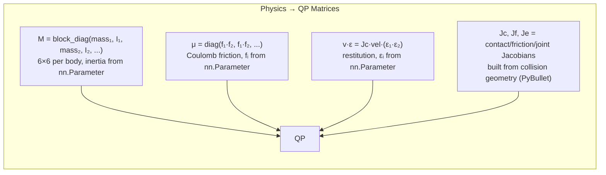

Read [](file:///home/xiao/0_codes/PIN-WM/diff_simulation/solver/util.py#1-1), lines 1 to 80

Read [](file:///home/xiao/0_codes/PIN-WM/diff_simulation/solver/cvxpy.py#1-1), lines 1 to 50

Read [](file:///home/xiao/0_codes/PIN-WM/diff_simulation/solver/batch.py#1-1), lines 1 to 50

Read [](file:///home/xiao/0_codes/PIN-WM/diff_simulation/solver/batch.py#50-50), lines 50 to 280

**Yes, the entire LCP solver is borrowed from `locuslab/lcp-physics` and `locuslab/qpth` (Stanford/MIT).** The copyright headers are explicit:

```
This file originates from:
https://github.com/locuslab/lcp-physics, licensed under Apache 2.0
For compatibility with newer PyTorch, merged with code from:
https://github.com/locuslab/qpth, licensed under Apache 2.0
```

PIN-WM's only contribution in lcp_solver.py is building the physics-specific LCP matrices (`M`, `u`, `G`, `h`, `F`) from the robot bodies — the solver itself is entirely borrowed.

---

## How the LCP solver works

### 1. Why an LCP?

Rigid body contact dynamics with friction is naturally a **Linear Complementarity Problem**:

$$0 \leq \lambda \perp \phi(\mathbf{v}) \geq 0$$

Where:
- $\lambda$ = contact impulse (force × time)
- $\phi(\mathbf{v})$ = relative velocity at contact point

The complementarity means: either there's separation ($\phi > 0, \lambda = 0$) or there's contact ($\phi = 0, \lambda \geq 0$), but never both positive.

### 2. From physics to QP matrices

PIN-WM builds the matrices in lcp_solver.py:



The physics parameters enter **inside these matrices** — friction in $\mathbf{\mu}$ (which goes into $\mathbf{F}$), restitution in $\mathbf{h}$ (via $\mathbf{v} \cdot \varepsilon$), mass/inertia in the block-diagonal $\mathbf{M}$.

### 3. The QP formulation

The LCP is reformulated as a Quadratic Program:

$$\min_{\mathbf{z}} \frac{1}{2}\mathbf{z}^T\mathbf{Q}\mathbf{z} + \mathbf{p}^T\mathbf{z} \quad \text{s.t.} \quad \mathbf{G}\mathbf{z} \leq \mathbf{h}, \quad \mathbf{A}\mathbf{z} = \mathbf{b}$$

Where $\mathbf{z}$ concatenates the new velocities and contact impulses.

### 4. Primal-Dual Interior Point Method (PDIPM)

The solver (in batch.py) uses a **primal-dual interior point method** — the gold standard for convex QPs:

```
for iteration in 1..max_iter:
    1. Compute residuals: rx, rs, rz, ry (primal + dual feasibility gaps)
    2. Compute duality measure: μ = (s·z)/n (average complementarity)
    3. Affine step: solve KKT system for (dx, ds, dz, dy)
    4. Centering step: Mehrotra predictor-corrector with σ = (μ_aff/μ)^3
    5. Line search: find α such that s + α·ds > 0 and z + α·dz > 0
    6. Update: x += α·dx, s += α·ds, z += α·dz, y += α·dy
```

### 5. Differentiability: Custom backward pass

The critical piece is `LCPFunctionFn.backward()` — it computes gradients through the QP solution analytically using the **implicit function theorem** applied to KKT conditions:

At optimality, the KKT system is:

$$\begin{bmatrix} \mathbf{Q} & 0 & \mathbf{G}^T & \mathbf{A}^T \\ 0 & \mathbf{D} & \mathbf{I} & 0 \\ \mathbf{G} & \mathbf{I} & \mathbf{F} & 0 \\ \mathbf{A} & 0 & 0 & 0 \end{bmatrix} \begin{bmatrix} d\mathbf{x} \\ d\mathbf{s} \\ d\mathbf{z} \\ d\mathbf{y} \end{bmatrix} = -\begin{bmatrix} d\mathbf{Q}\,\mathbf{x}^* + \dots \\ \vdots \end{bmatrix}$$

The backward pass solves this **same KKT system** but with a different right-hand side (the incoming gradient $\frac{\partial L}{\partial \mathbf{z}^*}$), using the **already-factorized matrices** from the forward pass. This gives:

$$\frac{\partial L}{\partial \mathbf{Q}}, \frac{\partial L}{\partial \mathbf{p}}, \frac{\partial L}{\partial \mathbf{G}}, \frac{\partial L}{\partial \mathbf{h}}, \frac{\partial L}{\partial \mathbf{F}}$$

Which then flow into the physics parameters via the chain rule shown earlier.

### Summary of what's borrowed vs original

| Component | Source | Role in PIN-WM |
|---|---|---|
| batch.py (PDIPM solver) | `locuslab/qpth` | QP forward + backward |
| cvxpy.py (reference solver) | `locuslab/lcp-physics` | Non-differentiable baseline |
| util.py (matrix helpers) | `locuslab/qpth` | bger, bdiag, expandParam |
| lcp_solver.py (LCP construction) | **PIN-WM original** | Builds M, μ, Jc, Jf, Je from bodies |
| simulator.py (step, collision) | **PIN-WM original** | Orchestrates physics ←→ render pipeline |
| physical_material.py | **PIN-WM original** | nn.Parameter wrapping of physics knobs |

Created 6 todos