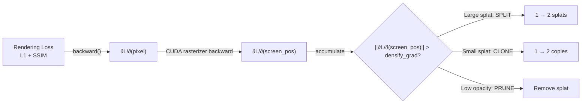

Two good questions:

## 1. Is 15,000 universal or codebase-specific?

**Empirical, not universal.** It comes from the original 3DGS paper (Kerbl et al., SIGGRAPH 2023) where they tuned it on standard benchmarks (Mip-NeRF 360, Tanks&Temples). Most follow-up works keep it because:

- On **bounded indoor/object scenes** (like your tomato can): 7k–15k is usually enough
- On **unbounded outdoor scenes** (Mip-NeRF 360): 15k–30k is typical
- For **very large scenes**: some works extend to 50k+

In this codebase the default is only 5,000 (`opt.iterations = 5_000` in `arguments/__init__.py`) — lowered because PIN-WM only needs a decent static reconstruction, not SOTA novel-view quality. The densification window is `densify_from_iter=500` to `densify_until_iter=15_000`, but total training stops at 5k, so densification runs from 500→5,000 here.

## 2. Is the differentiable renderer involved during densification?

**Yes, absolutely.** The gradient signal driving densification flows through the renderer:

```python
# Training loop — every iteration:
render_pkg = render(viewpoint_cam, gaussians, pipe, background)
image = render_pkg["render"]

loss = (1 - λ) * L1(image, gt) + λ * (1 - SSIM(image, gt))
loss.backward()  # ← gradients flow through CUDA rasterizer

# The renderer exposes screen-space gradients:
viewspace_points = render_pkg["viewspace_points"]  # screen-space (x,y,z)
# viewspace_points.grad contains ∂L/∂(screen_pos)

# Accumulate per-splat gradient magnitude:
gaussians.add_densification_stats(viewspace_points, visibility_filter)
# internally: xyz_gradient_accum += ||∂L/∂(screen_pos)||₂
```

The decision logic:



This is a defining feature of 3DGS/2DGS — the **same backward pass** that optimizes splat parameters also tells you *where* you need more or fewer splats. Unlike NeRF which samples rays on a fixed grid, Gaussian Splatting's adaptive density is driven purely by the rendering gradient.

Created 19 todos